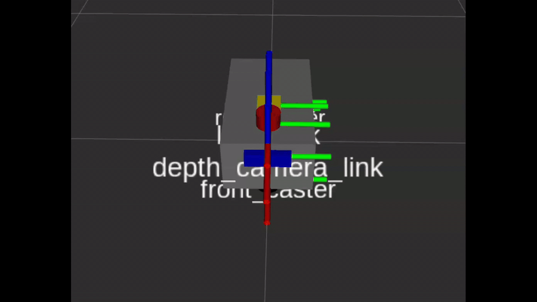
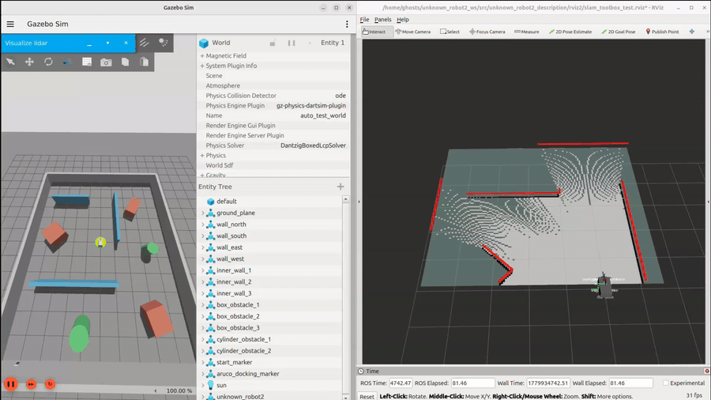
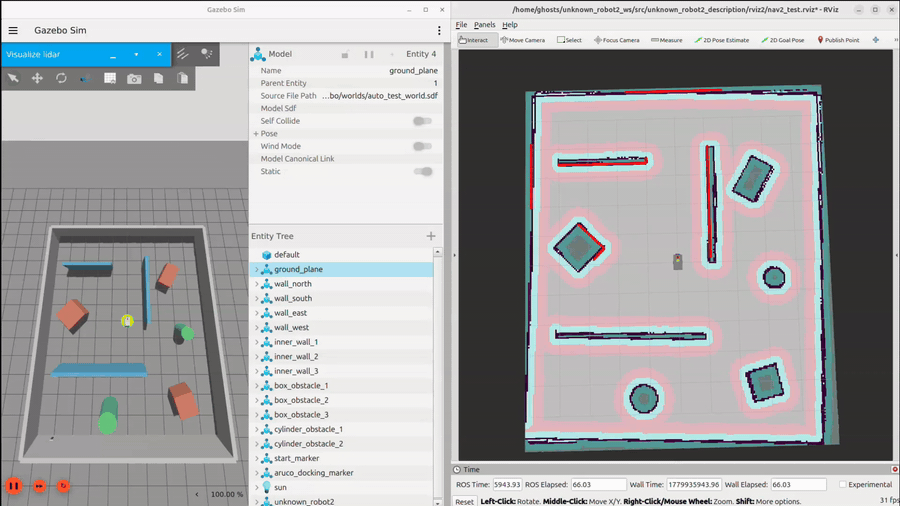

# unknown_robot2

<p align="center">
  
</p>

`unknown_robot2` is a ROS 2 mobile robot project for simulation, SLAM, localization, and autonomous navigation using Nav2.

This project contains the robot description, Gazebo simulation files, navigation configuration, maps, launch files, and RViz setup for a custom differential-drive mobile robot.

## What Can You Do With It?

- Simulate a custom mobile robot in Gazebo
- Visualize robot model, TF, laser scan, odometry, and map in RViz2
- Build a map using SLAM Toolbox
- Navigate autonomously using Nav2
- Test global planner and local planner behavior
- Tune costmaps, inflation layer, controller, and planner parameters

## Features

- ROS 2 Jazzy / Ubuntu 24.04 support
- Gazebo simulation
- Differential-drive robot model
- LiDAR sensor support
- Camera sensor support
- IMU support
- SLAM Toolbox mapping
- Nav2 autonomous navigation
- AMCL localization
- RViz2 visualization

## Workspace Structure

```text
unknown_robot2_ws/
├── LICENSE
├── README.md
└── src
    ├── unknown_robot2_bringup
    │   ├── LICENSE
    │   ├── package.xml
    │   ├── resource
    │   │   └── unknown_robot2_bringup
    │   ├── setup.cfg
    │   ├── setup.py
    │   ├── test
    │   │   ├── test_copyright.py
    │   │   ├── test_flake8.py
    │   │   └── test_pep257.py
    │   └── unknown_robot2_bringup
    │       └── __init__.py
    ├── unknown_robot2_description
    │   ├── CMakeLists.txt
    │   ├── include
    │   │   └── unknown_robot2_description
    │   ├── launch
    │   │   └── display.launch.py
    │   ├── LICENSE
    │   ├── media
    │   │   └── materials
    │   ├── meshes
    │   ├── package.xml
    │   ├── rviz
    │   │   ├── nav2_test.rviz
    │   │   ├── odom_test.rviz
    │   │   ├── slam_toolbox_test.rviz
    │   │   └── unknown_robot2.rviz
    │   ├── src
    │   └── urdf
    │       └── unknown_robot2.urdf.xacro
    ├── unknown_robot2_gazebo
    │   ├── config
    │   │   └── empty_world.config
    │   ├── launch
    │   │   ├── empty_gazebo.launch.py
    │   │   ├── gazebo.launch.py
    │   │   └── gz_slam_world.launch.py
    │   ├── LICENSE
    │   ├── package.xml
    │   ├── resource
    │   │   └── unknown_robot2_gazebo
    │   ├── setup.cfg
    │   ├── setup.py
    │   ├── test
    │   │   ├── test_copyright.py
    │   │   ├── test_flake8.py
    │   │   └── test_pep257.py
    │   ├── unknown_robot2_gazebo
    │   │   ├── __init__.py
    │   │   └── odom_to_tf.py
    │   └── worlds
    │       ├── auto_test_world.sdf
    │       └── empty.sdf
    └── unknown_robot2_navigation
        ├── behavior_trees
        │   └── nav_to_pose_clear_costmap.xml
        ├── config
        │   ├── nav2_map_params.yaml
        │   └── nav2_slam_params.yaml
        ├── launch
        │   ├── nav2_map.launch.py
        │   └── nav2_slam.launch.py
        ├── LICENSE
        ├── maps
        │   ├── auto_test_map.pgm
        │   └── auto_test_map.yaml
        ├── package.xml
        ├── resource
        │   └── unknown_robot2_navigation
        ├── setup.cfg
        ├── setup.py
        ├── test
        │   ├── test_copyright.py
        │   ├── test_flake8.py
        │   └── test_pep257.py
        └── unknown_robot2_navigation
            └── __init__.py
```

## Requirements

- Ubuntu 24.04
- ROS 2 Jazzy
- Gazebo Harmonic
- Nav2
- SLAM Toolbox
- RViz2
- `ros_gz` bridge packages

Install common dependencies:

```bash
sudo apt update
sudo apt install -y \
  ros-jazzy-navigation2 \
  ros-jazzy-nav2-bringup \
  ros-jazzy-slam-toolbox \
  ros-jazzy-robot-state-publisher \
  ros-jazzy-joint-state-publisher \
  ros-jazzy-joint-state-publisher-gui \
  ros-jazzy-rviz2 \
  ros-jazzy-ros-gz \
  ros-jazzy-xacro
```

## Installation

Clone the repository:

```bash
cd ~
git clone git@github.com:wattanatum/unknown_robot2.git unknown_robot2_ws
cd unknown_robot2_ws
```

Install dependencies:

```bash
rosdep update
rosdep install --from-paths src -y --ignore-src
```

Build the workspace:

```bash
colcon build --symlink-install
```

Source the workspace:

```bash
source install/setup.bash
```

Optional: add to `.bashrc`:

```bash
echo "source ~/unknown_robot2_ws/install/setup.bash" >> ~/.bashrc
source ~/.bashrc
```

# Quickstart

## Check robot TF
```bash
ros2 launch unknown_robot2_description display.launch.py
```
## SLAM Toolbox Mapping

<p align="center">
  
</p>

### Terminal 1: Launch Gazebo Simulation

```bash
ros2 launch unknown_robot2_gazebo gazebo.launch.py 
```

### Terminal 2: Launch SLAM Mapping

```bash
ros2 launch slam_toolbox online_async_launch.py use_sim_time:=true
```

### Terminal 3: Launch nav2 for move and avoid obstacle whlie mapping

```bash
ros2 launch unknown_robot2_navigation nav2_slam.launch.py
```

### Terminal 4: Run RViz2

```bash
rviz2
```
Open RViz2 config in this path:

```text
~/unknown_robot2_ws/src/unknown_robot2_description/rviz2/slam_toolbox_test.rviz
```

### 5. Save Map

```bash
ros2 run nav2_map_server map_saver_cli \
  -f ~/unknown_robot2_ws/src/unknown_robot2_navigation/maps/auto_test_map
```

## Navigation with Saved Map

<p align="center">
  
</p>

### Terminal 1: Launch Gazebo Simulation

```bash
ros2 launch unknown_robot2_gazebo gazebo.launch.py 
```

### Terminal 2: Launch nav2 with saved map

```bash
ros2 launch unknown_robot2_navigation nav2_map.launch.py
```

### Terminal 3: Run RViz2

```bash
rviz2
```
Open RViz2 config in this path:

```text
~/unknown_robot2_ws/src/unknown_robot2_description/rviz2/nav2_test.rviz
```

## Important ROS 2 Topics

| Topic | Description |
|---|---|
| `/cmd_vel` | Robot velocity command |
| `/odom` | Odometry data |
| `/scan` | LiDAR scan |
| `/imu` | IMU data |
| `/tf` | Dynamic transforms |
| `/tf_static` | Static transforms |
| `/map` | Occupancy grid map |
| `/goal_pose` | Navigation goal pose |

## Navigation Stack

This project uses Nav2 for autonomous navigation.

Main Nav2 components:

- Planner Server
- Controller Server
- Behavior Tree Navigator
- AMCL
- Map Server
- Global Costmap
- Local Costmap
- Recovery Behaviors
- Velocity Smoother

## Costmap Tuning

Inflation layer example:

```yaml
inflation_layer:
  plugin: nav2_costmap_2d::InflationLayer
  inflation_radius: 0.25
  cost_scaling_factor: 3.0
```

Lower `inflation_radius` reduces the obstacle safety area.

Higher `cost_scaling_factor` makes obstacle cost drop faster.

## Build Again After Editing Code

```bash
cd ~/unknown_robot2_ws
colcon build --symlink-install
source install/setup.bash
```

## Troubleshooting

### Robot does not move

Check:

```bash
ros2 topic echo /cmd_vel
ros2 topic echo /odom
ros2 run tf2_tools view_frames
```

### No map in RViz2

Check:

```bash
ros2 topic list | grep map
ros2 topic echo /map --once
```

### No LiDAR scan

Check:

```bash
ros2 topic echo /scan
```

### TF problem

Check:

```bash
ros2 run tf2_ros tf2_echo odom base_link
```

## Author

Kasiphat Uppaphak  
GitHub: [wattanatum](https://github.com/wattanatum)

